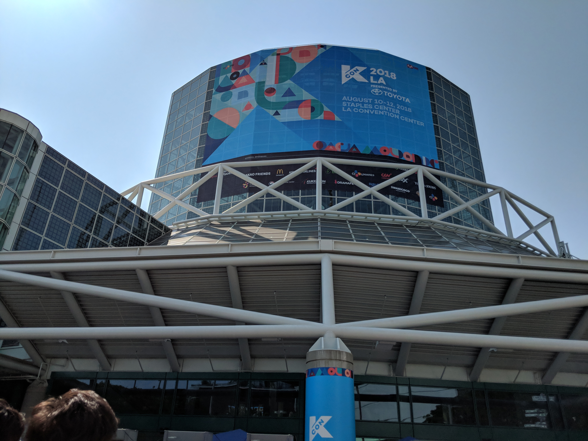
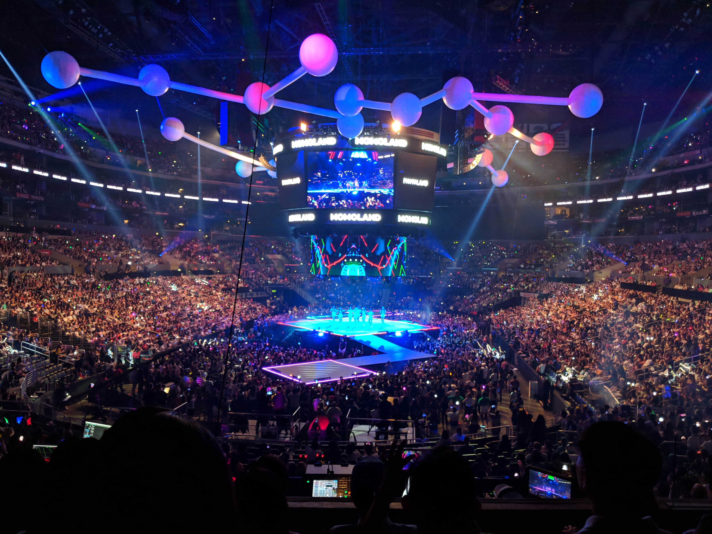
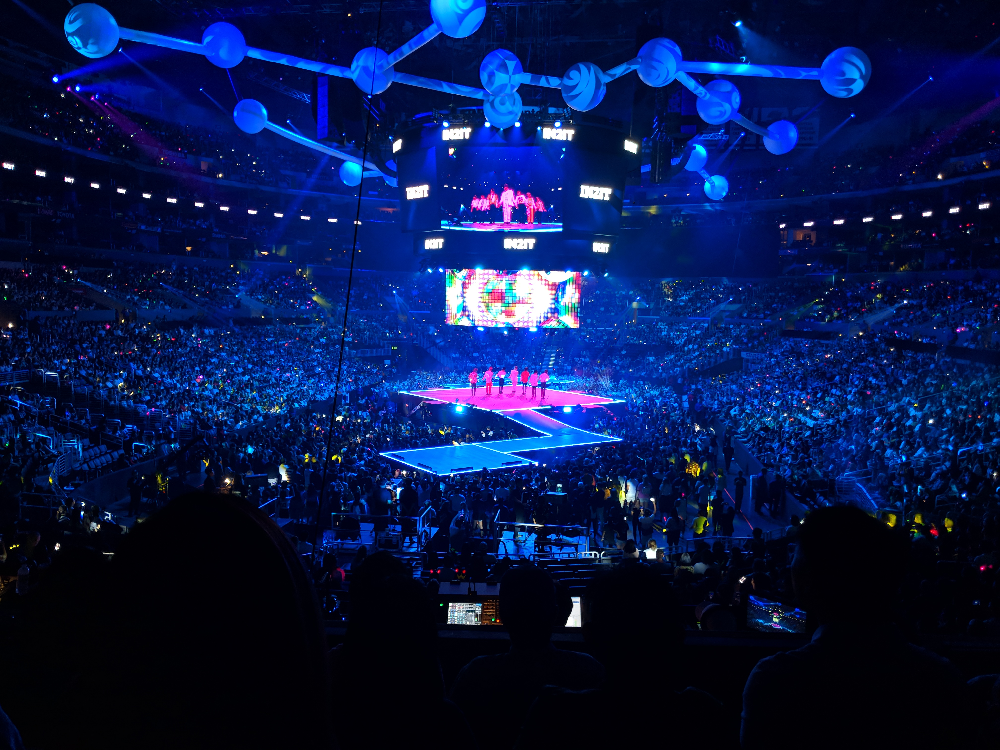
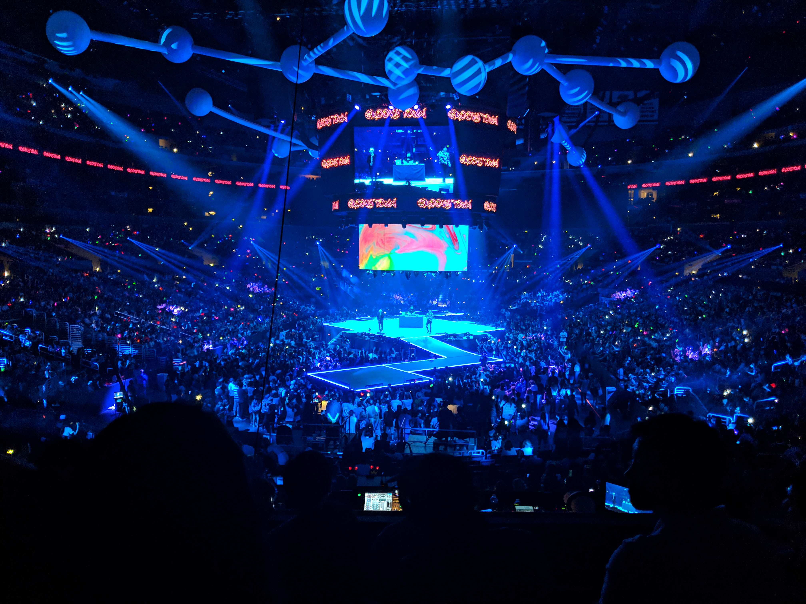
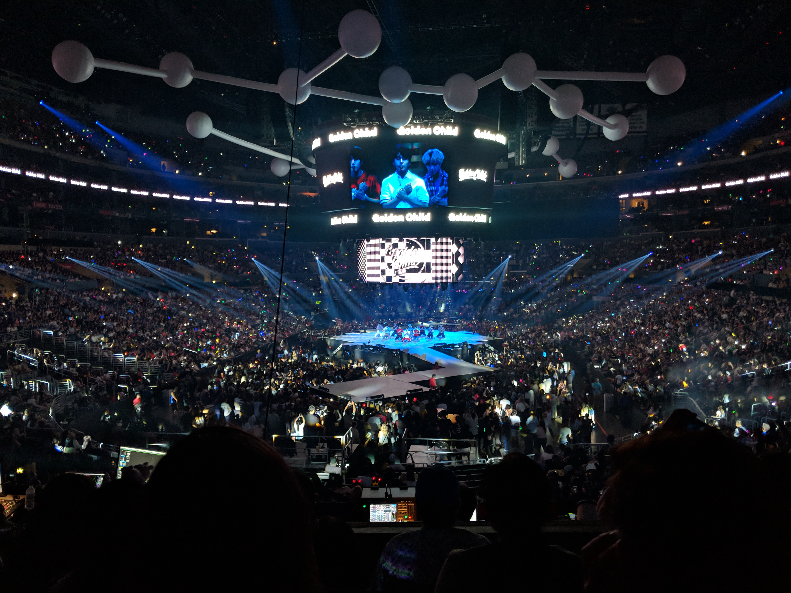
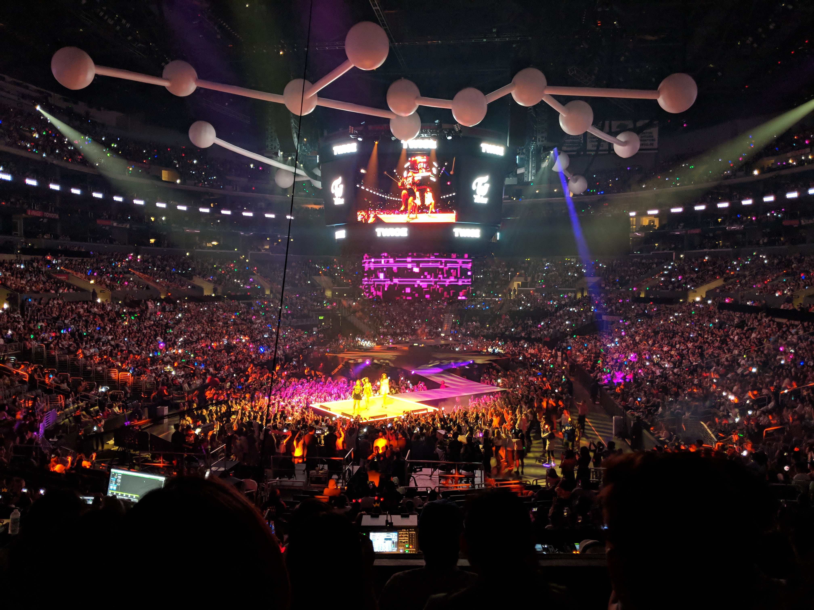
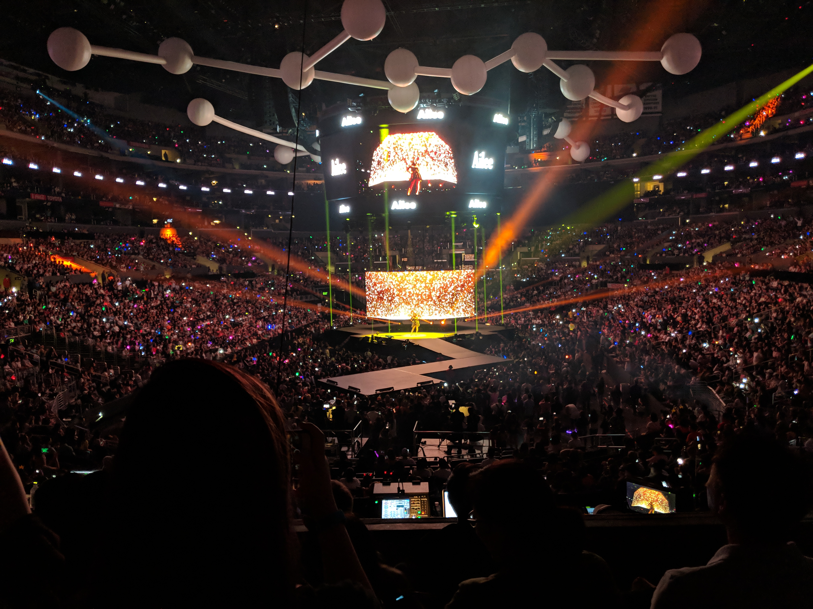
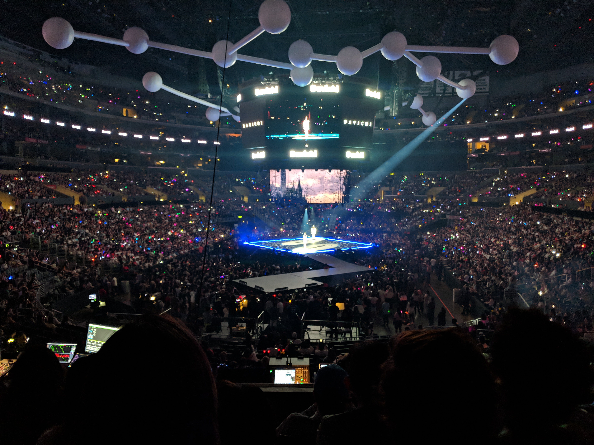
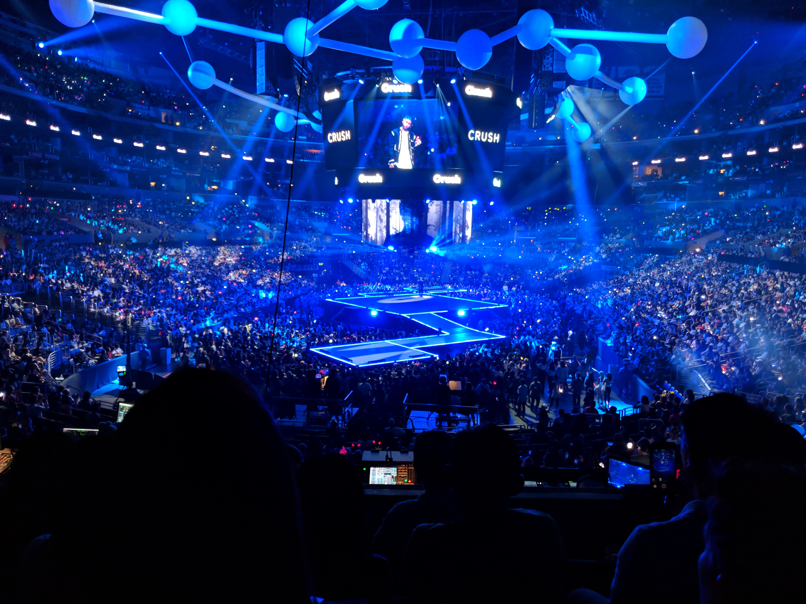
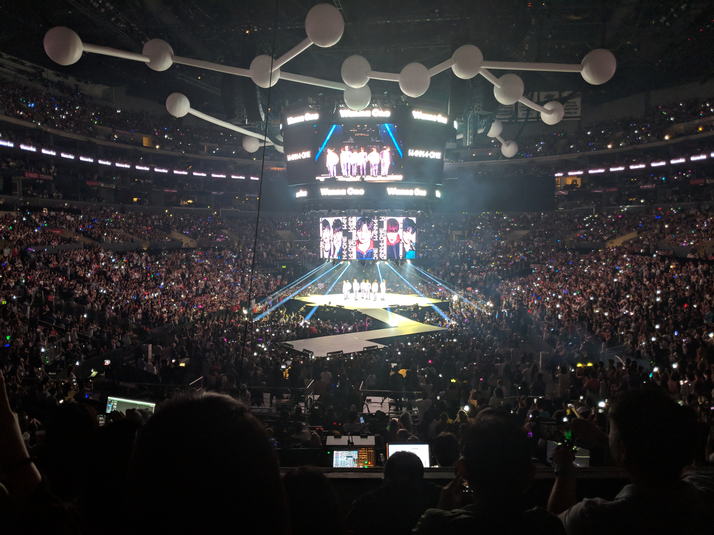

I had the opportunity to attend KCON [again](/blog/kcon-2017) this year!

## Convention

This year, we spent more time at the convention center before the concert. There were a lot of cool companies showcasing and selling their work.

I ended up eating the same food as last year, if I remember correctly. I had a delicious tempura platter and kimbap.

Also, we ended up parking in a structure that was one of the furthest ones away. Well, whatever. I have to get those 8000 steps in somehow.

### Security

Before entering the convention, I discovered that I had forgotten to leave my multi-tool (contains a knife) in our vehicle. Everyone has to go through a metal detector before entering. Personal items (phone, keys, etc.) are put a bin to be manually checked.

I was pretty sure I would be flagged for carrying the item but decided to try anyways. To my surprise, the security personnel barely glanced at the items (including the multi-tool) in the plastic bin and let me pass.

While I was happy that I did not have to make a trip back to our vehicle, the lax security is a point of concern. It would not be very difficult for others to sneak in dangerous items.

## Concert

This time around, we had the opportunity to enjoy the concert from one of the lounges or from general seating. 

We did both. Before the concert started, we checked out the lounge to see what it had to offer.

The lounge had a pretty awesome view and "free" food and drinks. We took pictures to show off the view we had, ate some food, enjoyed a few drinks, and then headed down before the show began.

Still a fantastic view from the general seats! We decided to watch the concert from here, as opposed to the lounge, because we believed we would experience more "energy" here.

The lineup for this day was:

- Ailee
- Dynamic Duo
- Crush
- Golden Child
- IN2IT
- Momoland
- TWICE
- Wanna One
- Davichi
- Mia

There was also a pre-show Taekwondo performance.

## Final Thoughts

Like last year, I had a fantastic time at the convention and concert! Although, to be honest, I am not sure we would have attended had it not been for the complimentary tickets.

We did enjoy the event but we are not as invested in Korean culture as other activities. Nonetheless, we appreciated the opportunity and had a great time!

Here's the part where I dump some photos of the event!

