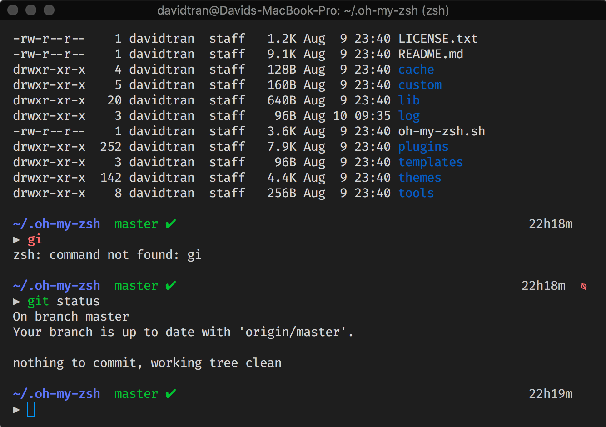

I recently joined the cool kids club by purchasing a Macbook Pro. I have primarly used Windows but was exposed to the Apple ecosystem for the better part of a year in my professional careers.  

While I still appreciate the Windows operating system, at the moment, I find that developing software is less of a hassle with macOS. Hearing MinGW and Cygwin may or may not make me cringe.

Also, while Windows Subsystem for Linux (WSL) is greatly improving the development workflow on Windows, macOS is based on Unix so many things come straight out of the box.

Since I wrote a bit about my [windows terminal workflow](/blog/windows-terminal-workflow-guide), I thought I could document something similar as I transition to macOS.



## Homebrew

First, we are going to install [Homebrew](https://brew.sh/). This is a package manager for macOS that will make installing future software more simple.

To install, just issue the following command in your terminal:

```bash
/usr/bin/ruby -e "$(curl -fsSL https://raw.githubusercontent.com/Homebrew/install/master/install)"
```

## iTerm2

We will be using [iTerm2](https://iterm2.com/) as our terminal emulator. I like it because it is pretty performant and customizable! Go ahead and download the application straight from their site.

You will probably want to tweak the settings a bit to make it look how you want. We will add themes and plugins after we install our zsh but you can change the colors, fonts, etc. at this point. 

Also, as a personal preference, I changed the working directory of iTerm2 (the location where it starts up) to `/Users/davidtran/code`.

[Here](https://gist.github.com/davidlamt/19355b211f4a7174ac48ab43aa86658b) is my current iTerm2 profile, if you are interested.

## zsh

zsh is just a Unix shell with additional features. It is just one of the many shells you can use; I use this one simply because it was the [first one I picked up](/blog/windows-terminal-workflow-guide).

Let's install it!

```bash
brew install zsh
```

Easy, right? Praise the great Homebrew!

## Oh My Zsh

[Oh My Zsh](https://github.com/robbyrussell/oh-my-zsh) is a framework for managing zsh configurations.

Install it with:

```bash
sh -c "$(curl -fsSL https://raw.githubusercontent.com/robbyrussell/oh-my-zsh/master/tools/install.sh)"
```

### Theme

The theme I am using is [Avit](https://github.com/robbyrussell/oh-my-zsh/blob/master/themes/avit.zsh-theme). It displays the current path (up to 3 previous directories). The current branch and its state (clean, dirty) is shown if the current directory is initialized with Git.

Also, I especially appreciate how it provides a new line for every new command. I do not need to navigate the current line to see what I type which might consume a non-zero amount of energy. #smallwins

This theme, along with [many others](https://github.com/robbyrussell/oh-my-zsh/wiki/themes), are installed along with Oh My Zsh. You can also install custom themes.

To use the bundled themes, set `ZSH_THEME` to your theme of choice in `~/.zshrc`.

```bash
ZSH_THEME="avit"
```

### Plugins

Similar to themes, there are [numerous bundled plugins](https://github.com/robbyrussell/oh-my-zsh/tree/master/plugins). I am still in the process of finding ones that improve my workflow but one I enjoy using is [zsh-syntax-highlighting](https://github.com/zsh-users/zsh-syntax-highlighting).

This plugin was actually a custom plugin so I had to install it manually.

```bash
 git clone https://github.com/zsh-users/zsh-syntax-highlighting.git ${ZSH_CUSTOM:-~/.oh-my-zsh/custom}/plugins/zsh-syntax-highlighting
```

Afterwards, we need to add it to `plugins` in `~/.zshrc`.

```bash
plugins=(
  git
  zsh-syntax-highlighting
)
```

## Final Thoughts

So far, I am enjoying using iTerm2. I was already familiar with zsh and Oh My Zsh from when I set it up on Windows but the installation and maintenance seems easier with a true Unix shell.

I am also trying to utilize Vim full-time on personal projects, [again](/blog/vim-progress-update). Look out for a post on setting up vim and tmux!

