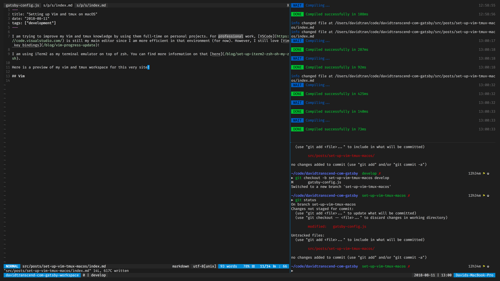

I am trying to improve my Vim and tmux knowledge by using them full-time on personal projects. For professional work, [VSCode](https://code.visualstudio.com/) is still my main editor since I am more efficient in that environment (for now). However, I still love [Vim key bindings](/blog/vim-progress-update)!

I am using iTerm2 as my terminal emulator on top of zsh. You can find more information on that [here](/blog/set-up-iterm2-zsh-oh-my-zsh).

Here is a preview of my Vim and tmux workspace for this very site!



## Vim

["Vim is a highly configurable text editor for efficiently creating and changing any kind of text."](https://www.vim.org/)

Vim should already be installed with macOS but it may be an outdated version.

We are going to install Vim via [Homebrew](https://brew.sh/):

```bash
brew install vim --with-override-system-vi
```

This command will override the Vim bundled with macOS with Homebrew's version. This will also make updating Vim easier (`brew upgrade vim`).

[As before](/blog/using-vim-for-a-week), I strongly advocate for only adding Vim configurations you fully understand. Also, I still believe in and strive for this dream:

**Things start to happen almost as fast as you can think of them when you use Vim**.

Translation: You can focus your energy on actual problem solving and Vim will take care of the rest.

[Here](https://gist.github.com/davidlamt/77b6c48ee3b84d66711cc7922f36c5e8) is my current Vim configurations for those interested! Be aware that it is not very well-organized. I hope to pick up some more useful configurations / plugins (and organization concepts) as I go.

### Plugins

Notable Vim plugins shown in the picture above:

- [vim-airline](https://github.com/vim-airline/vim-airline)
- [vim-dark-code](https://github.com/tomasiser/vim-code-dark)

You are welcome. I know that you want a fantastic looking Vim editor as well!

## tmux

["tmux is a terminal multiplexer. It lets you switch easily between several programs in one terminal, detach them (they keep running in the background) and reattach them to a different terminal. And do a lot more."](https://github.com/tmux/tmux/wiki) 

I enjoy running Vim inside tmux sessions because it allows me to have multiple terminal panes and windows that are easily accessible, in addition to multiple Vim panes, windows, tabs, etc. I feel like a true hacker now.

I know that iTerm2 supports split panes as well but I think learning tmux is still more beneficial. tmux can easily be installed on many different platforms (even servers) while iTerm2 is tied down to macOS.

Again, we will use Homebrew to install tmux.

```bash
brew install tmux
```

!@#$, I love Homebrew.

And my girlfriend (if you are reading this). 😅

### Plugins

I am using the [tmuxline](https://github.com/edkolev/tmuxline.vim) Vim plugin to have tmux's status line be consistent with Vim. Side note, if you could not tell, I love the color blue.

Also, you read that right. tmuxline is a _Vim_ plugin.

[View my tmux configurations](https://gist.github.com/davidlamt/444ad0d60a09a9a3e10a58a4ce884531).

### Scripts

tmux also allows you to create scripts that will automate your workspace setup. This is pretty useful because it allows you to get your development environment set up quickly and with a single command!

I want to adopt creating a `tmux-workspace.sh` script in my personal projects that will get my development environment up and running quickly and easily.

Here's the [tmux setup script](https://github.com/davidlamt/davidtranscend-com-gatsby/blob/master/tmux-workspace.sh) for this site!

At the moment, I have a single pane dedicated to editing files with Vim, a pane for starting the Gatsby development server, and one more pane for issuing shell commands (Git commands, creating files, etc.).

### Caveats

I ran into a few issues when trying to set up tmux and, thankfully, found solutions.

#### tmuxline Not Showing at Beginning

I noticed that whenever I start a tmux session, the tmuxline status styles were not being applied until I started a Vim window. We need to save the tmuxline configurations and source it on tmux startup to solve this.

The tmuxline plugin provides a `:TmuxlineSnapshot` command that will copy your current tmuxline configurations to a file. Once we have that file, we can source it inside `~/.tmux.conf`:

```bash
source-file ~/.tmuxline.conf
```

#### Alt Modifier

I use the left alt modifier key in some of my tmux mappings but they did not seem to work in iTerm2. I was able to solve this by going into Preferences -> Profiles -> Keys and then changing the 'Left Modifier Key' to 'Esc+'.

#### Vim Background Different in tmux

For some reason, at least in iTerm2, the Vim editor's background was different inside tmux versus outside. I wanted the editor's background to be consistent regardless of where it was opened.

This was solved by adding `export TERM=screen-256color` to my shell's configuration file (`~/.zshrc` for me).

## Final Thoughts

In addition to looking cool, I love how I can accomplish almost all my development needs within a single application. I also believe that these tools save me time, no matter how minuscule.

Another benefit of this setup is that I use my keyboard almost exclusively. I am trying to improve my posture so that my future self does not suffer (too severly) and I think this is a good start.

