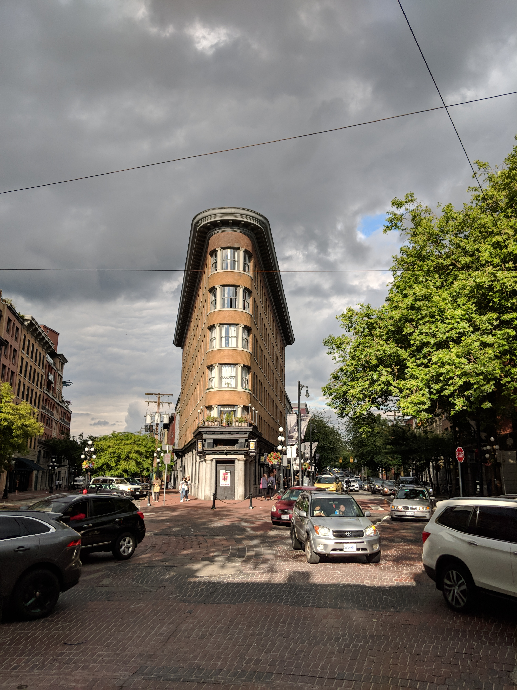

I recently went on a four day trip to [Vancouver, BC](https://en.wikipedia.org/wiki/Vancouver) with my girlfriend. Well, we spent most of the fourth day at the airport and traveling home so it was actually three days of activities.

Just thought I would share of of the cool things we did along with some photos I took! Just so everyone knows that I am a normal person who does normal things. I do not just write code all day. Okay, maybe I do sometimes.

## Day 1

We woke up pretty early on the first day to make an early flight. We wanted to arrive in Canada before noon so we could visit more places on the day we arrived. Little did I know that this was the start of a tiring two day cycle. More on this later.

Some of the places we visited on this day were:

- [Capilano Suspension Bridge Park](https://www.tripadvisor.com/Attraction_Review-g181717-d156257-Reviews-Capilano_Suspension_Bridge_Park-North_Vancouver_British_Columbia.html)
- [Gastown](https://www.tripadvisor.com/Attraction_Review-g154943-d155842-Reviews-Gastown-Vancouver_British_Columbia.html)

I was amazed at how large the Capilano Suspension Bridge Park was because most people talk about the bridge itself but it is a _park_. There were many other attractions like the treetop bridges and cliffwalk. Personally, the main suspesion bridge was not that scary and was pretty cool to walk across.

Gastown reminds me of the "downtowns" of some cities. There are many interesting shops and restaurants to visit. We checked out a few gift shops and the iconic view in the picture above.

## Day 2

Our second day was mostly spent hiking [Lindeman Lake](https://www.tripadvisor.com/Attraction_Review-g154927-d11645372-Reviews-Lindeman_Lake-Chilliwack_British_Columbia.html).

Again, we woke up early so that we could get there before it got too crowded. Plus, we did not want to be hiking during the hotter hours of the day.

Here, we are some pretty breathtaking views. I may or may not have hurt myself taking those photos.

The hike was moderate; there was a good amount of uphill. Definitely one of the more challenging hikes I've been on but not super difficult. However, take that with a grain of salt as I have not been on enough hikes to make a good comparison.

We certainly slept well this night - finally got to sleep in as well.

## Day 3

Our main attraction this day was the [VanDusen Botanical Garden](https://www.tripadvisor.com/Attraction_Review-g154943-d184433-Reviews-VanDusen_Botanical_Garden-Vancouver_British_Columbia.html).

Oh boy, I felt like I had not been to real botanical garden after experiencing this. Large would be an understatement. This place was massive plants from everywhere.

## Closing Thoughts

One of the many things we noticed was that TripAdvisor is used for more scenic locations compared to Yelp in the states. Also, everything is in kilometers and gas is by litre and cents-based. That was a fun surprise. 🙃

As I mentioned earlier, we were pretty exhausted the first two days. We definitely had a lot of fun but once we had some time to rest, we experienced how tired our bodies actually were.

I have noticed that I become more tired during "vacations". It seems that when we decide to take some time off to go "relax", we pack our schedule so that we can experience more things that we usually do not have the opportunity to.

While this frequently leads to more enjoyment, the hectic schedule often causes exhaustion after the fact. As a result, it may be easy to burn out even while on vacation.

Also, this leads to a desire for a "post-vacation" where we truly relax after the initial vacation. Have any of you experienced something similar before?

Anyhow, this was an awesome first trip (for me) to Canada. I enjoyed some of the things the country offered and would definitely come back in the future!